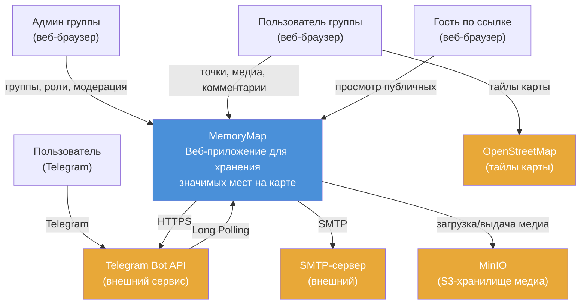
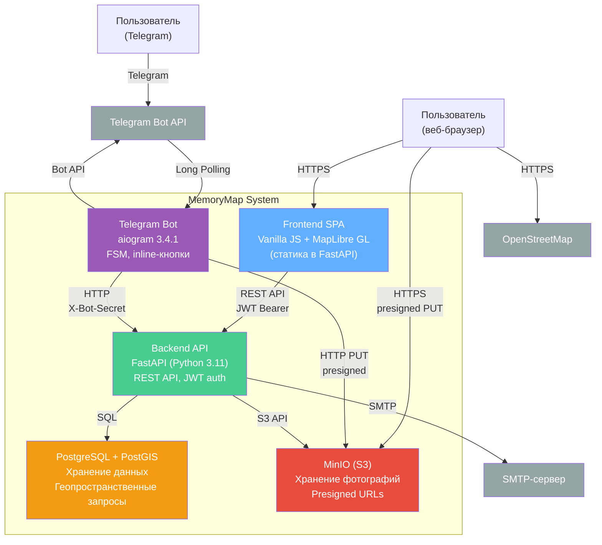
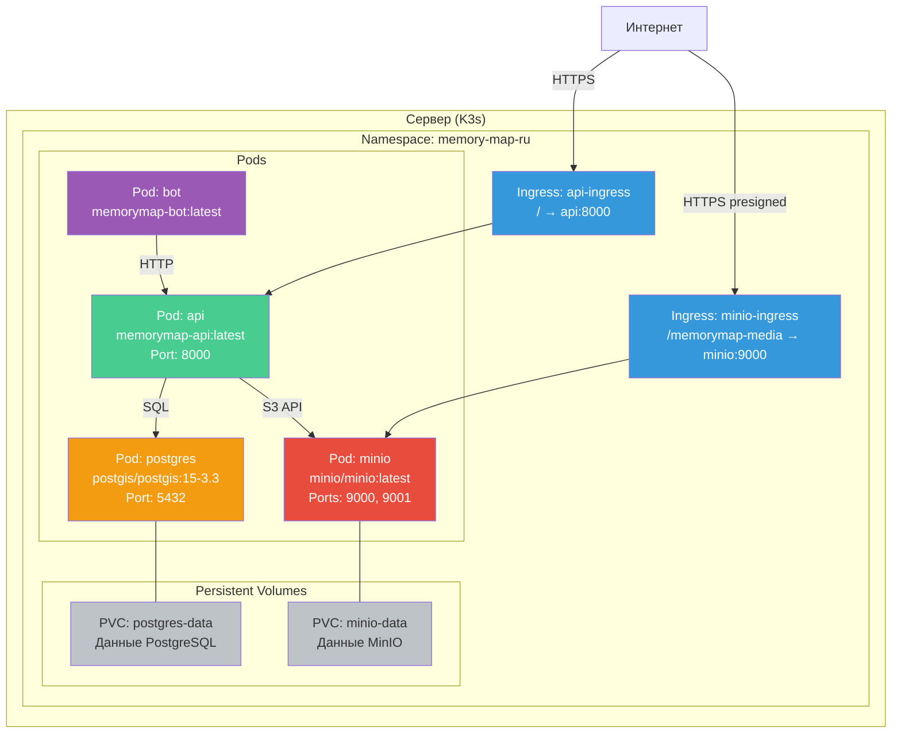

# Архитектура MemoryMap

---

## Содержание

- [C4 Level 1 — Контекст системы](#c4-level-1--контекст-системы)
- [C4 Level 2 — Контейнеры](#c4-level-2--контейнеры)
- [Диаграмма развёртывания](#диаграмма-развёртывания)
- [GRASP-паттерны](#grasp-паттерны)

---

## C4 Level 1 — Контекст системы

Диаграмма показывает MemoryMap как единую систему и её взаимодействие с внешними акторами и сервисами.



**Акторы:**
- **Пользователь группы** — авторизованный пользователь: добавляет/просматривает точки, медиа, комментарии.
- **Админ группы** — владелец/администратор: создаёт группы, назначает роли (editor/viewer), модерирует контент.
- **Гость по ссылке** — неавторизованный пользователь, открывший ссылку вида `/?place=ID`: просматривает публичные точки.
- **Пользователь (Telegram)** — взаимодействует через Telegram-бота: создание точек по геолокации, редактирование.

**Внешние системы:**
- **Telegram Bot API** — приём и отправка сообщений бота (Long Polling).
- **SMTP-сервер** — отправка кодов подтверждения email и восстановления пароля.
- **OpenStreetMap** — растровые тайлы карты для отображения в MapLibre GL.
- **MinIO (S3)** — S3-совместимое хранилище фотографий, загрузка/скачивание через presigned URLs.

---

## C4 Level 2 — Контейнеры

Диаграмма показывает внутреннюю структуру системы: контейнеры и их взаимодействия.



### Описание контейнеров

| Контейнер      | Технология              | Ответственность                                                |
|----------------|-------------------------|----------------------------------------------------------------|
| Frontend SPA   | Vanilla JS + MapLibre GL | Отображение карты, UI взаимодействия, загрузка фото в S3      |
| Backend API    | FastAPI (Python 3.11)   | REST API, авторизация (JWT), бизнес-логика, генерация presigned URLs |
| Telegram Bot   | aiogram 3.4.1           | Приём команд/геолокации, FSM-диалоги, загрузка фото            |
| PostgreSQL     | PostGIS 15-3.3          | Хранение пользователей, точек, групп, комментариев, уведомлений |
| MinIO          | S3-совместимое хранилище | Хранение фотографий, presigned URLs для загрузки/скачивания    |

### Протоколы взаимодействия

| От           | К              | Протокол                        | Описание                                    |
|--------------|----------------|---------------------------------|----------------------------------------------|
| Frontend     | API            | REST / JSON, JWT Bearer token   | Все операции пользователя                    |
| Frontend     | MinIO          | HTTPS PUT (presigned URL)       | Загрузка фотографий напрямую                 |
| Bot          | API            | HTTP / JSON, X-Bot-Secret      | Создание/редактирование точек, подключение аккаунта |
| Bot          | MinIO          | HTTP PUT (presigned URL)       | Загрузка фотографий из Telegram              |
| API          | PostgreSQL     | SQL (psycopg2)                  | CRUD-операции, геопространственные запросы    |
| API          | MinIO          | S3 API (boto3)                  | Генерация presigned URLs, перемещение файлов |
| API          | SMTP           | SMTP (smtplib)                  | Отправка email с кодами подтверждения        |
| Bot          | Telegram API   | HTTPS (aiogram)                 | Отправка/приём сообщений, inline-кнопки      |

---

## Диаграмма развёртывания

Развёртывание на K3s-кластере:



### Процесс деплоя

```
1. rsync → /tmp/memorymap/ (на сервере)
2. docker build -t memorymap-api:latest
3. docker save | k3s ctr images import
4. kubectl rollout restart deployment/api
5. kubectl rollout status --timeout=180s
```

Для бота — аналогичный процесс с `memorymap-bot:latest`.

> Frontend входит в API-образ (COPY в Dockerfile.api) — при изменении фронтенда нужна пересборка API.

---

## GRASP-паттерны

### Information Expert

**Принцип**: объект, обладающий данными для выполнения операции, должен быть ответственным за неё.

**Применение в проекте:**
- **PlaceService** определяет `moderation_status` при создании/обновлении точки — он знает о типе группы (публичная/личная) и роли автора (admin/moderator/user). Логика: публичная группа + обычный пользователь → `pending`; admin/moderator → `approved`.
- **GroupService** проверяет membership при добавлении точки в группу — сервис владеет информацией о ролях участников и может определить, имеет ли пользователь право на запись.
- **ReportService** управляет жалобами: знает о категориях, проверяет дубликаты (unique per user+place), определяет текущий статус точки.

### Creator

**Принцип**: объект A должен создавать объект B, если A содержит, агрегирует или тесно использует B.

**Применение в проекте:**
- API-роутеры делегируют создание доменных объектов сервисам. Роутер `places.py` вызывает `PlaceService.create_place()`, который создаёт запись Place, определяет статус модерации и возвращает результат.
- Роутер `comments.py` после создания комментария вызывает `NotificationService.create_comment_notification()` — комментарий тесно связан с уведомлением (одно порождает другое).

### Controller

**Принцип**: объект-посредник между UI и бизнес-логикой.

**Применение в проекте:**
- Роутеры FastAPI (`backend/app/api/`) выступают **thin controllers**: принимают HTTP-запрос, валидируют данные через Pydantic, проверяют авторизацию через `Depends(get_current_user)`, вызывают сервис, формируют ответ. Вся бизнес-логика — в сервисах.

```python
# Пример thin controller (places.py)
@router.post("/places")
def create_place(
    p: PlaceCreate,
    current_user: User = Depends(get_current_user),
    db: Session = Depends(get_db),
):
    pid = PlaceService.create_place(db=db, group_id=p.group_id,
                                    user_id=current_user.id, ...)
    return {"id": pid}
```

### Low Coupling

**Принцип**: минимизация зависимостей между компонентами.

**Применение в проекте:**
- **Трёхслойная архитектура**: `api/` → `services/` → `models/` — каждый слой зависит только от следующего.
- **Бот ↔ API**: Telegram-бот общается с backend **исключительно через HTTP API**, не имеет прямого доступа к БД. Это позволяет менять реализацию API без изменения бота и наоборот.
- **Frontend ↔ API**: SPA взаимодействует через REST API. Frontend не знает о внутренней структуре backend.
- **MinIO ↔ Клиенты**: загрузка фотографий идёт напрямую от клиента в MinIO через presigned URLs — API не проксирует медиа-трафик.

### High Cohesion

**Принцип**: каждый модуль сосредоточен на одной зоне ответственности.

**Применение в проекте:**

| Сервис             | Зона ответственности                         |
|--------------------|----------------------------------------------|
| `PlaceService`     | CRUD точек, модерация, перемещение между слоями |
| `GroupService`     | CRUD групп, membership, видимость             |
| `FriendsService`      | Дружба, запросы, двусторонние связи           |
| `CommentService`      | Комментарии, треды                            |
| `NotificationService` | Уведомления о комментариях и ответах          |
| `ReportService`       | Жалобы, категории, статусы                    |
| `BlockService`        | Блокировка пользователей, побочные эффекты    |
| `GroupInviteService`  | Приглашения в группы, принятие/отклонение     |
| `email` (модуль)      | Отправка email через SMTP                     |
| `UserService`         | Профиль, смена пароля/email/логина, удаление  |

Каждый сервис работает с одной доменной областью. Пересечения минимальны — например, роутер `comments.py` вызывает `NotificationService` для создания уведомления при новом комментарии.

### Indirection

**Принцип**: промежуточный объект снижает прямую связанность между компонентами.

**Применение в проекте:**
- **Presigned URLs** — посредник между клиентом и MinIO. Клиент не знает реальных credentials S3, API не проксирует файлы. Presigned URL — одноразовый токен доступа с ограниченным сроком жизни.
- **X-Bot-Secret** — посредник аутентификации между ботом и API. Бот не использует JWT-токены пользователей, а аутентифицируется общим секретом и передаёт `tg_id` для идентификации пользователя.
- **`storage.py`** — абстракция над S3 API (boto3). Сервисы вызывают `presign_put()`, `move_to_place_folder()`, `delete_object()` — не работают напрямую с boto3-клиентом.

### Pure Fabrication

**Принцип**: искусственный объект, не соответствующий доменной модели, но необходимый для распределения ответственности.

**Применение в проекте:**
- **Notification** создаётся как побочный эффект комментария. `NotificationService` не соответствует ни одной бизнес-сущности — это техническая конструкция для доставки информации пользователю. Уведомление привязано к комментарию, точке и актору, но не является частью доменной модели комментариев.
- **TelegramLinkCode** — одноразовый код для подключения Telegram. Не является частью доменной модели пользователя, существует только как промежуточный артефакт процесса подключения.
- **Middleware для security headers** — добавляет `X-Content-Type-Options` и `X-Frame-Options` ко всем ответам. Не связан с бизнес-логикой, но необходим для безопасности.
